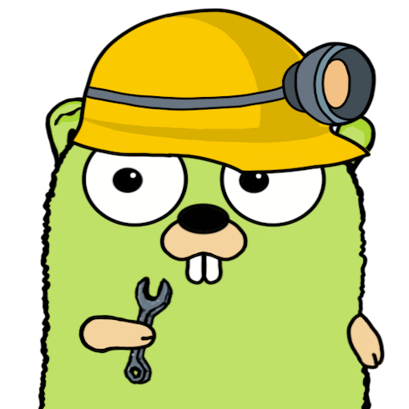

<!-- Improved compatibility of back to top link: See: https://github.com/RealAlexandreAI/json-repair/pull/73 -->
<a name="readme-top"></a>
<!--
*** Thanks for checking out the Best-README-Template. If you have a suggestion
*** that would make this better, please fork the repo and create a pull request
*** or simply open an issue with the tag "enhancement".
*** Don't forget to give the project a star!
*** Thanks again! Now go create something AMAZING! :D
-->


<!-- PROJECT SHIELDS -->
<!--
*** I'm using markdown "reference style" links for readability.
*** Reference links are enclosed in brackets [ ] instead of parentheses ( ).
*** See the bottom of this document for the declaration of the reference variables
*** for contributors-url, forks-url, etc. This is an optional, concise syntax you may use.
*** https://www.markdownguide.org/basic-syntax/#reference-style-links
-->
[![Contributors][contributors-shield]][contributors-url]
[![Forks][forks-shield]][forks-url]
[![Stargazers][stars-shield]][stars-url]
[![Issues][issues-shield]][issues-url]
[![GPL License][license-shield]][license-url]


<!-- PROJECT LOGO -->
<br />
<div align="center">
  <a href="https://github.com/RealAlexandreAI/json-repair">
    
  </a>

<h3 align="center">json-repair</h3>

  <p align="center">
    JSON Repair: Solution for JSON Anomalies from LLMs.
    <br />
    <a href="https://goplay.tools/snippet/zyLfsLcsTwg">Online Playground</a>
    ·
    <a href="https://github.com/RealAlexandreAI/json-repair/issues/new?labels=bug&template=bug-report---.md">Report Bug</a>
    ·
    <a href="https://github.com/RealAlexandreAI/json-repair/issues/new?labels=enhancement&template=feature-request---.md">Request Feature</a>
  </p>
</div>


<!-- ABOUT THE PROJECT -->

## 🔧 Repair JSON! Solution for JSON Anomalies from LLMs

Welcome to the json-repair, your go-to solution for fixing those pesky JSON anomalies that can sidetrack your Large
Language Model (LLM) processes. Our toolkit is designed to be the Swiss Army knife for all your JSON repair needs.

### 🎯 Why Choose JSON Repair?

- 🏎️ GO Compatibility: Our library ensures a seamless experience for Go developers with its excellent compatibility.
- 🔗 Zero Dependencies: We've crafted a tool with zero external dependencies, keeping it lean and mean.
- 📚 Rich Test Cases: Benefit from a comprehensive suite of test cases that ensure reliability and accuracy.
- 🤖 Auto-Detection & Repair: Intelligently identifies and corrects a wide range of JSON errors, from syntax to
  structural issues.
- 📐 Terminal CLI Support: The feature can also be used in the command-line and can be chained with command pipes.
- ⚙️ No Anxiety About Error: json-repair always gives the string result.
- 🌐 Open Source: Join a vibrant community of developers contributing to the ongoing evolution of the toolkit.

### 🔍 Supported Broken LLM JSON Output

- Single quote `"`
- Line feed `\n`
- Improperly formatted JSON string `{"key": TRUE, "key2": FALSE, "key3": Null  `
- String with mixed quotes `{'key': 'string', 'key2': false, \"key3\": null, \"key4\": unquoted}`
- Unclosed array `[1, 2, 3, 4`
- Unclosed array object `{"employees":["John", "Anna",`
- Standalone left bracket `[`
- Standalone right bracket `]`
- Array with extra line breaks `[[1\n\n]`
- Incorrect key-value pair `{foo: [}`
- Correct JSON string `{"text": "The quick brown fox won\'t jump"}`
- Incorrect key-value pair `{"value_1": "value_2": "data"}`
- JSON string with comment `{"value_1": true, COMMENT "value_2": "data"}`
- JSON string with leading spaces  `- { "test_key": ["test_value", "test_value2"] }`
- String containing a link `{ "content": "[LINK]("https://google.com")" }`
- Unclosed link string `{ "content": "[LINK](" }`
- Unclosed link and extra key string `{ "content": "[LINK](", "key": true }`
- Incorrect key-value pair `{"key":"",}`
- etc.

<p align="right">(<a href="#readme-top">back to top</a>)</p>


<!-- GETTING STARTED -->

## 🏁 Getting Started

To add the JSON Repair to your Go project, use the following command:

```shell
go get github.com/RealAlexandreAI/json-repair
```

<!-- USAGE EXAMPLES -->

## Usage

```go
package main

import (
    "github.com/RealAlexandreAI/json-repair"
)

func main() {
    // broken JSON string from LLM
    in := "```json {'employees':['John', 'Anna', ```"

    jsonrepair.RepairJSON(in)

    // output:	{"employees":["John","Anna"]}
}
```

> Additionally, there is `MustRepairJSON` for scenarios that are not suitable for error handling, such as pipes and
> trusted environments

_For more examples, please refer to
the [Test Cases](https://github.com/RealAlexandreAI/json-repair/blob/master/main_test.go)
Or <a href="https://goplay.tools/snippet/zyLfsLcsTwg">Online Playground</a>_

<p align="right">(<a href="#readme-top">back to top</a>)</p>

## Terminal CLI

```bash

brew install realalexandreai/tap-jsonrepair/jsonrepair

# from raw string
jsonrepair -i "{'employees':['John', 'Anna', "
# output: {"employees":["John", "Anna", "Peter"]}

# from file
jsonrepair -f <json-file>.json
```

_You can also download binary from Release, please refer to
the [Releases](https://github.com/RealAlexandreAI/json-repair/releases)._


<!-- ROADMAP -->

## Roadmap

- [x] Convert project from Python
- [x] Minimum Go version
- [x] Cover test cases
- [x] Terminal CLI support
- [x] Workflow and GitHub Action
- [x] Add Homebrew tap
- [ ] Support Full-width character detection

See the [open issues](https://github.com/RealAlexandreAI/json-repair/issues) for a full list of proposed features (and
known issues).

<p align="right">(<a href="#readme-top">back to top</a>)</p>


<!-- CONTRIBUTING -->

## Contributing

Contributions are what make the open source community such an amazing place to learn, inspire, and create. Any
contributions you make are **greatly appreciated**.

If you have a suggestion that would make this better, please fork the repo and create a pull request. You can also
simply open an issue with the tag "enhancement".
Don't forget to give the project a star! Thanks again!

1. Fork the Project
2. Create your Feature Branch (`git checkout -b feature/AmazingFeature`)
3. Commit your Changes (`git commit -m 'Add some AmazingFeature'`)
4. Push to the Branch (`git push origin feature/AmazingFeature`)
5. Open a Pull Request

<p align="right">(<a href="#readme-top">back to top</a>)</p>

## Related Project

- [python json_repair](https://github.com/mangiucugna/json_repair) - Inspiration of json-repair.

<!-- LICENSE -->

## License

Distributed under the GPLv3 License. See `LICENSE` for more information.

<p align="right">(<a href="#readme-top">back to top</a>)</p>


<!-- CONTACT -->

## Contact

RealAlexandreAI - [@RealAlexandreAI](https://twitter.com/RealAlexandreAI)

Project Link: [https://github.com/RealAlexandreAI/json-repair](https://github.com/RealAlexandreAI/json-repair)

<p align="right">(<a href="#readme-top">back to top</a>)</p>


<!-- MARKDOWN LINKS & IMAGES -->
<!-- https://www.markdownguide.org/basic-syntax/#reference-style-links -->

[contributors-shield]: https://img.shields.io/github/contributors/RealAlexandreAI/json-repair.svg?style=for-the-badge

[contributors-url]: https://github.com/RealAlexandreAI/json-repair/graphs/contributors

[forks-shield]: https://img.shields.io/github/forks/RealAlexandreAI/json-repair.svg?style=for-the-badge

[forks-url]: https://github.com/RealAlexandreAI/json-repair/network/members

[stars-shield]: https://img.shields.io/github/stars/RealAlexandreAI/json-repair.svg?style=for-the-badge

[stars-url]: https://github.com/RealAlexandreAI/json-repair/stargazers

[issues-shield]: https://img.shields.io/github/issues/RealAlexandreAI/json-repair.svg?style=for-the-badge

[issues-url]: https://github.com/RealAlexandreAI/json-repair/issues

[license-shield]: https://img.shields.io/github/license/RealAlexandreAI/json-repair.svg?style=for-the-badge

[license-url]: https://github.com/RealAlexandreAI/json-repair/blob/master/LICENSE

[product-screenshot]: images/screenshot.png
